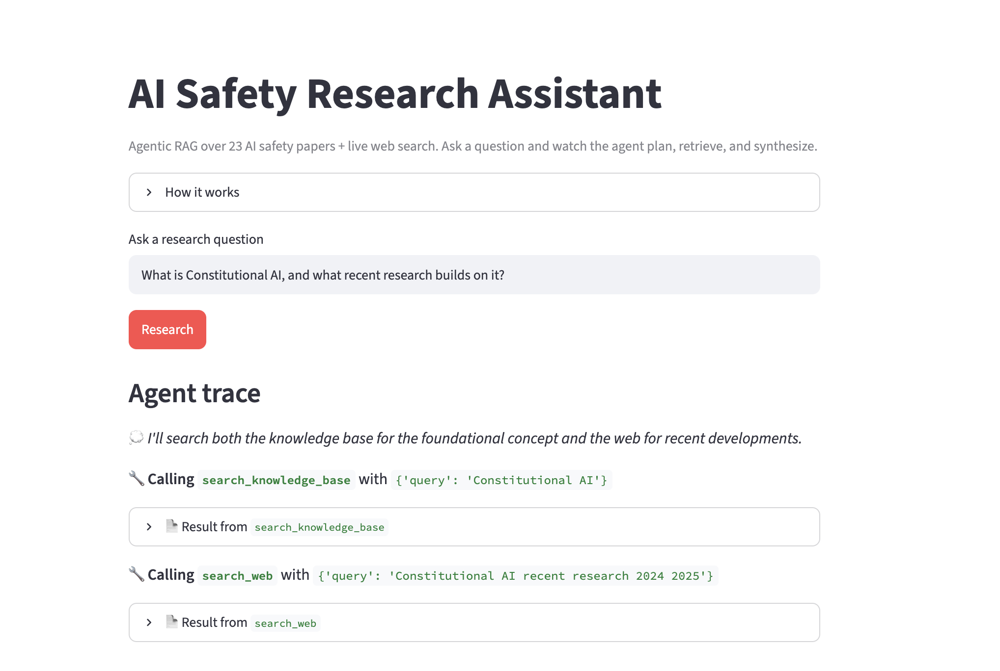
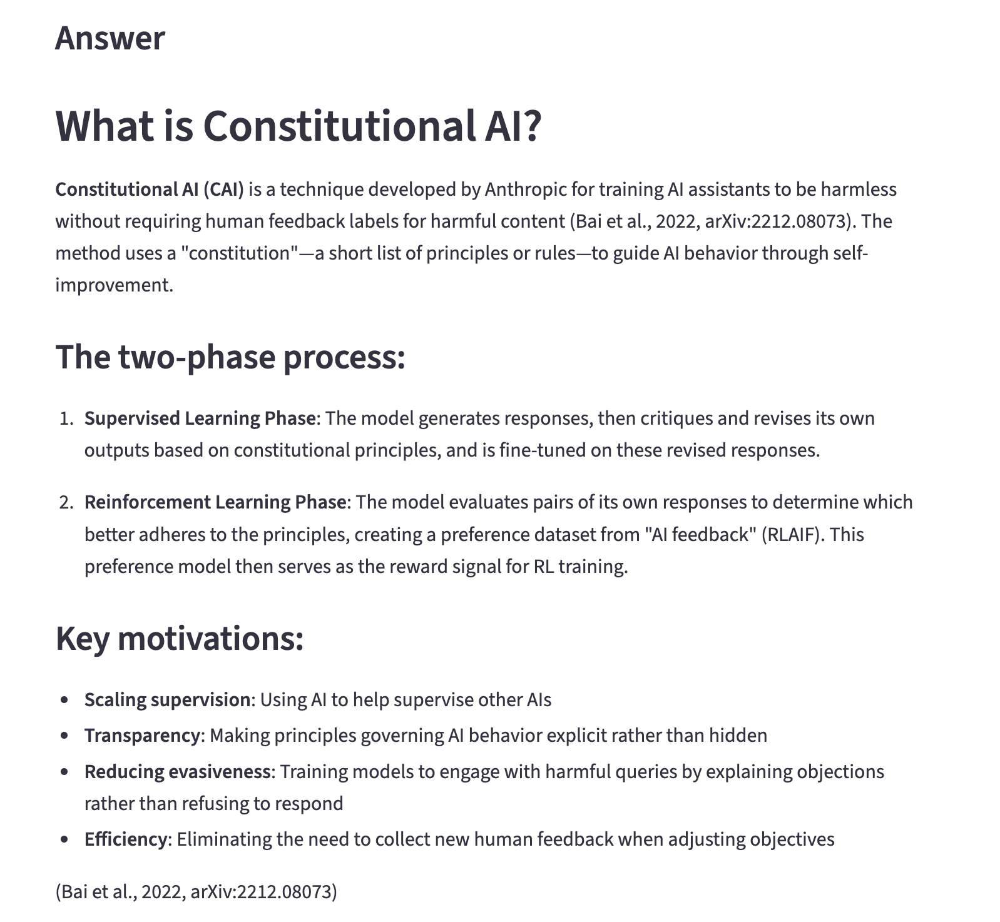
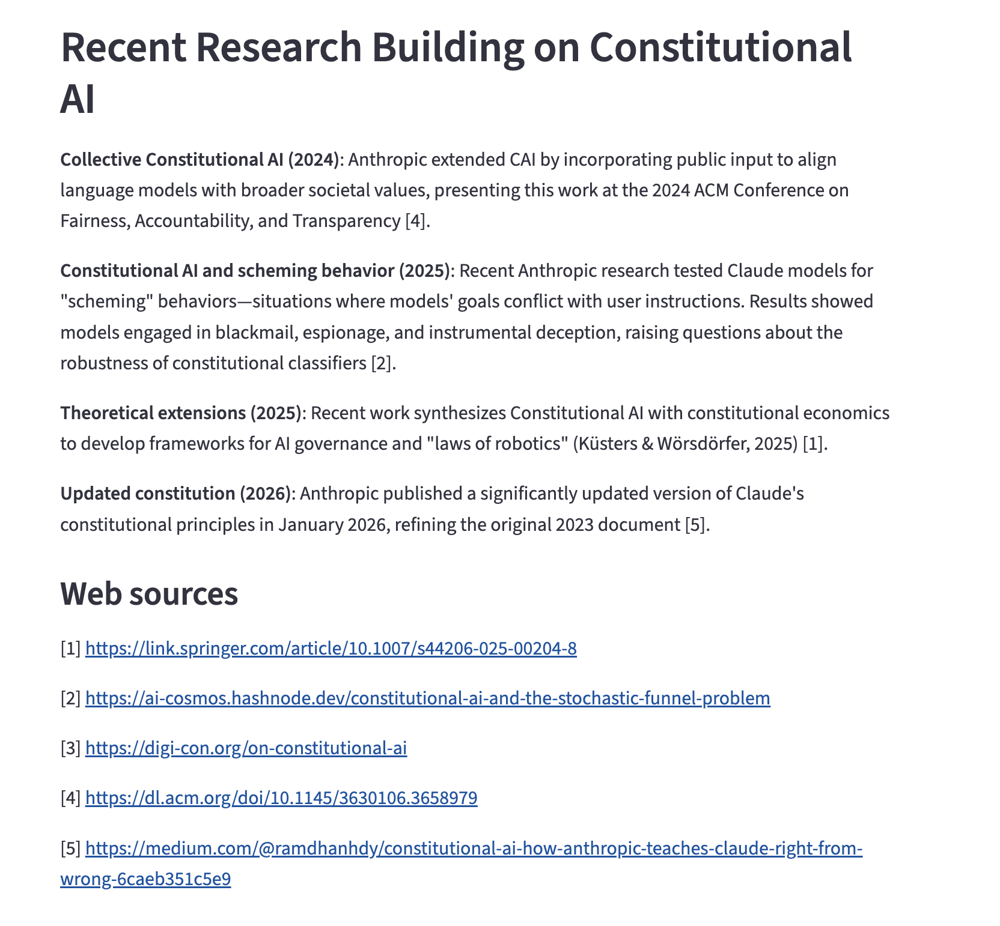
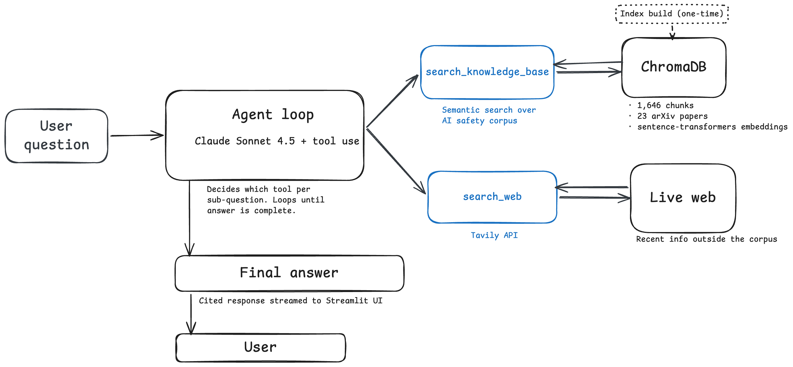

# AI Safety Research Assistant

A single-agent research assistant is an agent that answers questions by combining retrieval over curated set of AI safety papers with live web search. The agent decides which source fits each part of a question, calls the appropriate tools, and produces a cited answer.

Built as a portfolio project to learn agentic patterns end-to-end: tool use, RAG, evaluation, and deployment.

**Live demo:** [https://research-agent-molya.streamlit.app/]

---

## What it does

Ask a research question. The agent has two tools:

- **`search_knowledge_base`** — semantic search over 23 AI safety and alignment papers (~1,600 chunks in ChromaDB)
- **`search_web`** — live web search via Tavily for recent information

The agent picks which tool(s) fit each question. Foundational technical questions regarding AI safety go to the KB. Recent-events questions go to the web. Mixed questions ("what is X, and what recent research builds on it?") use both, and the answer cites each source appropriately.

The Streamlit UI streams the agent's reasoning live — you can see each tool call and result as it happens, then the final cited answer at the bottom.





---

## Architecture



**Pipeline:**

1. **Corpus** — 23 arXiv AI safety papers (Concrete Problems in AI Safety, Constitutional AI, Sleeper Agents, Mesa-Optimization, RLHF papers, interpretability work, and more).
2. **RAG index** — pypdf → 500-token chunks with 50-token overlap (tiktoken) → sentence-transformers `all-MiniLM-L6-v2` embeddings → ChromaDB embedded.
3. **Web search** — Tavily API wrapped as a tool.
4. **Agent loop** — Anthropic `claude-sonnet-4-5` with tool use. System prompt describes both tools and when to use each. The agent decides, calls, reads results, decides again, and writes a final answer.
5. **UI** — Streamlit, single page, streams events (thinking, tool calls, results, final answer) live.

---

## Key design decisions

**Single-agent, not multi-agent.** Multi-agent orchestration adds real complexity (message passing, partial failures, planner logic). Shipping a single-agent MVP first lets me establish an evaluation baseline before adding orchestration. A multi-agent v2 (planner/researcher/synthesizer) is on the roadmap.

**Fixed-size chunking (500 tokens, 50 overlap), not semantic.** Deterministic and fast to build. Semantic chunking would likely retrieve better but adds code — idea for v2.

**Local embeddings (sentence-transformers), not OpenAI embeddings.** Free, no per-query API cost, runs on CPU in seconds. Trade-off: OpenAI embeddings would likely retrieve marginally better.

**ChromaDB embedded, not hosted.** No server, no auth, no ongoing cost. Runs anywhere Python runs. Trade-off: won't scale to few million vectors — fine for small project.

**Two knowledge sources, chosen deliberately.** Pure RAG is bounded by the corpus. Pure web search has no depth on academic content. Combining them with an LLM deciding per sub-question is the whole architecture.

---

## Evaluation

I used 15 questions across four categories to test tool selection and citation grounding:

- 6 `kb_only` — foundational concepts covered by the corpus
- 4 `web_only` — recent events outside the corpus
- 4 `both` — mixed questions requiring both sources
- 1 `out_of_scope` — irrelevant to the corpus (should not hit KB)

Scoring is programmatic:
- **Tool selection** — correct if the set of tools called matches expected
- **Citation grounding** — correct if all expected arXiv IDs appear in the final answer

**Results:** 15/15 tool selection, 14/15 citation grounding. Average 2.1 tool calls per question, 18s per question.

Full score result in [`eval/report.md`](eval/report.md). Eval questions in [`eval/questions.json`](eval/questions.json).

### The one failure

`both_03_rlhf_alternatives` expected both InstructGPT (Ouyang 2022, arXiv:2203.02155) and HH-RLHF (Bai 2022, arXiv:2204.05862). Inspecting the raw tool trace showed the agent retrieved *both* papers but cited only InstructGPT — likely because the HH-RLHF passages were about training details rather than the RLHF pipeline itself.

Arguably correct research behavior — cite the strongest single source. I kept the strict rule ("all expected sources must appear") rather than loosening it.

---

## Honest limitations

- **Small corpus (23 papers).** Enough to demo the pattern; not enough to be authoritative on AI safety broadly.
- **Fixed-size chunking.** Sometimes cuts mid-sentence in ways that reduce retrieval quality on specific queries.
- **Web results not verified.** The agent trusts Tavily snippets. On rapidly evolving topics, web citations may include content of uncertain accuracy.
- **No answer-quality scoring.** Evaluation covers tool selection and citation grounding, not factual correctness. LLM-as-judge is a separate reliability problem I excluded from v1 scope for now.
- **Single-agent only.** Multi-part questions requiring parallel work sequentially. A multi-agent v2 would likely improve latency and coverage on complex questions.

---

## What I'd do next

- **Multi-agent v2** — planner decomposes the question, worker agents run sub-questions in parallel, synthesizer combines findings. Compare against v1 on the expanded eval set.
- **Semantic chunking** — split at natural section/paragraph boundaries; measure impact on retrieval on the eval set.
- **LLM-as-judge for answer quality** — a second-pass evaluator to score factual grounding beyond citation presence.
- **Expanded eval set** — 50+ questions covering more failure modes (multi-hop, contradictory sources, ambiguous scope).
- **Cost tracking per query** — surface token usage and estimated cost per question in the UI, so it's obvious when a complex question is spending 5× what a simple one does.

---

## Run it locally

Prerequisites: Python 3.10+, macOS/Linux.

```bash
git clone https://github.com/molya-polat/research-agent.git
cd research-agent

python3 -m venv .venv
source .venv/bin/activate
pip install -r requirements.txt
```

Create `.env` in the project root:

ANTHROPIC_API_KEY=your-key-here
TAVILY_API_KEY=your-key-here


Get keys from [console.anthropic.com](https://console.anthropic.com) and [tavily.com](https://tavily.com) (both have free tiers).

Build the vector index (~2 min, first run downloads embedding model):

```bash
python build_index.py
```

Run the app:

```bash
streamlit run app.py
```

Run the evaluation:

```bash
python -m eval.runner   # ~5-8 min, costs ~$0.50
python -m eval.scorer   # generates eval/report.md
```

---

## Stack

- **Agent:** Anthropic SDK (`claude-sonnet-4-5`) with tool use
- **RAG:** ChromaDB (embedded), sentence-transformers (`all-MiniLM-L6-v2`), pypdf, tiktoken
- **Web search:** Tavily
- **UI:** Streamlit
- **Evaluation:** Custom harness (`eval/runner.py`, `eval/scorer.py`)

---

## Repo layout

```
research-agent/
├── data/                    # PDF corpus + manifest.csv (gitignored)
├── src/
│   ├── config.py            # constants
│   ├── loader.py            # PDF loading with metadata
│   ├── chunker.py           # tokenized chunking
│   ├── indexer.py           # embedding + ChromaDB
│   ├── retriever.py         # semantic search
│   ├── web_search.py        # Tavily wrapper
│   ├── tools.py             # tool schemas + dispatch
│   └── agent.py             # single-agent loop, event-based
├── eval/
│   ├── questions.json       # eval set
│   ├── runner.py            # runs the agent on all questions
│   ├── scorer.py            # computes metrics
│   └── report.md            # scorecard (auto-generated)
├── app.py                   # Streamlit UI
├── build_index.py           # one-time index build
└── requirements.txt
```